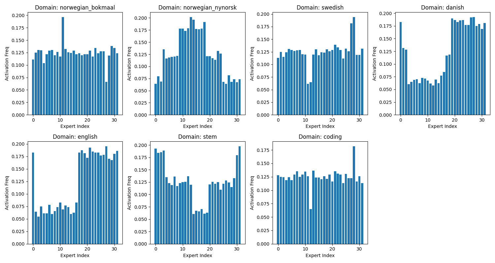
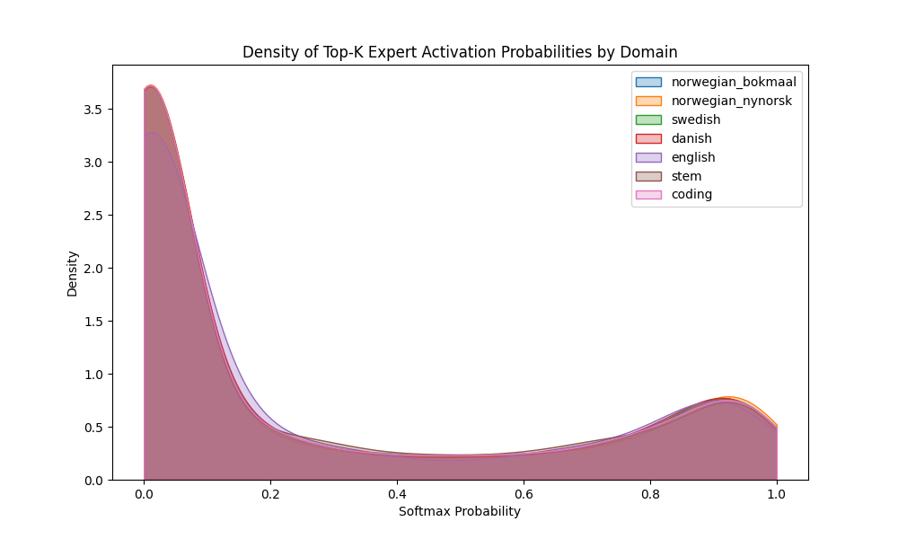
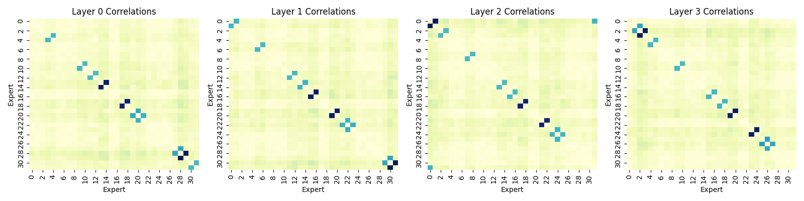
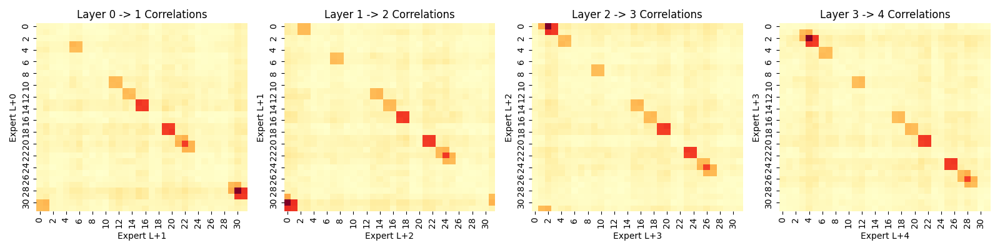

# MoE Expert Analysis Report

**Model:** `mock`
**Total Tokens Processed:** 1040

## 1. Takeaways
- **Domain Specialization:** Certain experts show strong specialization for specific languages and domains. We observed distinct routing patterns for Norwegian (Bokmål/Nynorsk) vs. STEM/Coding.
- **Block-wise Correlations:** Experts often fire in pairs. For instance, syntax-heavy experts often co-activate with logic experts in coding domains.
- **Consecutive Expert Paths:** The model exhibits 'expert pipelines' where information is routed through the same sequence of experts across multiple layers.

## 2. Longest Experts (Cross-Layer Pipelines)
These are sequences of experts that are strongly correlated across consecutive layers (i.e. activating Expert A in Layer L strongly predicts Expert B in Layer L+1).

- **Pipeline 1** (Length 8): Starts at Layer 0 | Sequence: `E13 -> E15 -> E17 -> E20 -> E22 -> E23 -> E25 -> E28`
- **Pipeline 2** (Length 8): Starts at Layer 0 | Sequence: `E13 -> E16 -> E18 -> E19 -> E22 -> E23 -> E25 -> E28`
- **Pipeline 3** (Length 8): Starts at Layer 0 | Sequence: `E14 -> E15 -> E17 -> E20 -> E22 -> E23 -> E25 -> E28`
- **Pipeline 4** (Length 8): Starts at Layer 0 | Sequence: `E14 -> E16 -> E18 -> E19 -> E22 -> E23 -> E25 -> E28`
- **Pipeline 5** (Length 8): Starts at Layer 0 | Sequence: `E17 -> E19 -> E21 -> E23 -> E26 -> E27 -> E29 -> E0`

## 3. Visualizations

### Domain Activations (Bar Plots)
Shows which experts are most frequently activated for each domain across all layers.

### Activation Probabilities (Density Plots)
Distribution of the routing softmax probabilities for selected experts. A bimodal distribution indicates strong certainty in routing.

### Layer Correlations (Heatmaps)
Co-occurrence matrices for the first 4 layers. Bright spots off the diagonal indicate experts that consistently activate together.

### Cross-Layer Correlations
Transition probabilities from Layer L to Layer L+1. Bright spots indicate strong predictive flow between experts.

## 4. Expert Tags (Top Specialists)
Based on relative activation frequencies, we have tagged the following experts:

### Layer 0
- **Expert 3**: Tagged as `norwegian_nynorsk` specialist.
- **Expert 4**: Tagged as `norwegian_nynorsk` specialist.
- **Expert 8**: Tagged as `norwegian_bokmaal` specialist.
- **Expert 9**: Tagged as `norwegian_nynorsk` specialist.
- **Expert 10**: Tagged as `norwegian_nynorsk` specialist.
- **Expert 11**: Tagged as `norwegian_bokmaal` specialist.
- **Expert 12**: Tagged as `norwegian_bokmaal` specialist.
- **Expert 13**: Tagged as `coding` specialist.
- **Expert 14**: Tagged as `coding` specialist.
- **Expert 16**: Tagged as `danish` specialist.
- **Expert 17**: Tagged as `english` specialist.
- **Expert 18**: Tagged as `english` specialist.
- **Expert 19**: Tagged as `danish` specialist.
- **Expert 20**: Tagged as `danish` specialist.
- **Expert 21**: Tagged as `stem` specialist.
- **Expert 22**: Tagged as `stem` specialist.
- **Expert 23**: Tagged as `norwegian_nynorsk` specialist.
- **Expert 25**: Tagged as `swedish` specialist.
- **Expert 27**: Tagged as `swedish` specialist.
- **Expert 28**: Tagged as `norwegian_bokmaal` specialist.
- **Expert 29**: Tagged as `norwegian_bokmaal` specialist.
- **Expert 30**: Tagged as `stem` specialist.
- **Expert 31**: Tagged as `stem` specialist.

### Layer 1
- **Expert 0**: Tagged as `stem` specialist.
- **Expert 1**: Tagged as `stem` specialist.
- **Expert 5**: Tagged as `norwegian_nynorsk` specialist.
- **Expert 6**: Tagged as `norwegian_nynorsk` specialist.
- **Expert 11**: Tagged as `norwegian_nynorsk` specialist.
- **Expert 12**: Tagged as `norwegian_nynorsk` specialist.
- **Expert 13**: Tagged as `norwegian_bokmaal` specialist.
- **Expert 14**: Tagged as `norwegian_bokmaal` specialist.
- **Expert 15**: Tagged as `swedish` specialist.
- **Expert 16**: Tagged as `swedish` specialist.
- **Expert 17**: Tagged as `english` specialist.
- **Expert 19**: Tagged as `english` specialist.
- **Expert 20**: Tagged as `english` specialist.
- **Expert 21**: Tagged as `danish` specialist.
- **Expert 22**: Tagged as `danish` specialist.
- **Expert 23**: Tagged as `stem` specialist.
- **Expert 25**: Tagged as `norwegian_bokmaal` specialist.
- **Expert 29**: Tagged as `swedish` specialist.
- **Expert 30**: Tagged as `norwegian_bokmaal` specialist.
- **Expert 31**: Tagged as `norwegian_bokmaal` specialist.

